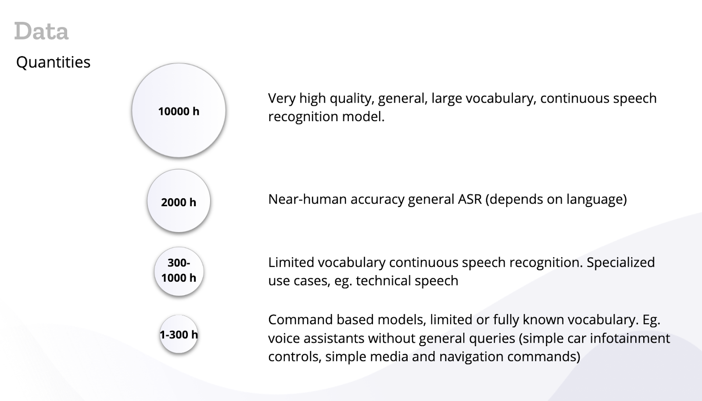

# Voice Corpus

### 🗣 Voice corpus

#### Our purpose

Donate and validate our voices under [public domain](https://voice.mozilla.org/terms) licence to generate a dataset usable by Speech to Text technologies to train models in different languages democratizing voice technology.

#### Who we are

We are a community of voice tech enthusiasts, who want to help collect and generate a large dataset of public domain voices that can be freely used to train [Speech to Text technologies](https://github.com/mozilla/DeepSpeech).

#### What’s success

Collect and validate as many voices as possible in our languages. Having more voices validated allows us to then train more advanced STT models.

* At least 1,000 unique speakers per language.
* 2,000 hours of voice validated to train a near-human general STT model.
* 10,000 hours of voice validated for a very high quality, general, large vocabulary, continuous speech recognition model.

#### 

#### How to join

Anyone can join this community. Join our [discourse forums](https://discourse.mozilla.org/c/voice/) or our [matrix chat](https://chat.mozilla.org/#/room/#common-voice:mozilla.org) and introduce yourself, jump into [Common Voice site](https://voice.mozilla.org), get familiar with it and start donating your voice.

🔨 _You don’t need any specialized skill to contribute to this community, you only need to be able to speak into a microphone or listen to audio clips._

#### What we do

⚠️ _In order to have a language enabled on our site, you will need at least 5000 validated sentences, see previous section about text corpus for reference._

**Voice donation**

We have developed a site that allows you to [donate your voice](https://voice.mozilla.org/speak) by reading sentences collected by the community.

Feel free to create an account to track your progress and add more information on your profile about your voice. Demographic information helps us balance the dataset, giving machine learning researchers and engineers a way to train models that represent better the speakers of the language.

ℹ️ [_Please read the following community guidelines_ ](https://discourse.mozilla.org/t/discussion-of-new-guidelines-for-recording-validation/36465)_to know how to produce better voice donations_.

⚠️ _Note: Once you have recorded a decent amount of clips in your language \(around 300\), it’s more valuable for less effort if you jump into helping to get new voices from other people and focus on the voice validation part, this will increase the dataset quality._

**Voice validation**

The same site allows you to [review other people’s voices](https://voice.mozilla.org/listen) by listening to voices donated by the community. Each recording will need at least **two** positive validations from different people. Feel free to create an account to track your progress, compare with other contributors, set yourself goals or get awards badges.

 ℹ️ [_Please read the following community guidelines_](https://discourse.mozilla.org/t/discussion-of-new-guidelines-for-recording-validation/36465) _to know how to better validate voices_.

**Community mobilization**

You can help the community by organizing activities and encouraging others to do the same. Use the channels we have at our disposal to engage with other contributors in your language, talk about your ideas to grow the community and collect and validate more voices.

ℹ️ _Check a few ideas from the_ [_Contribute to Common Voice activity_](https://community.mozilla.org/activities/contributing-to-common-voice/)_._

⭐️ _You can re-use any_ [_graphical material_](https://drive.google.com/drive/u/0/folders/1RfgsCI6-rs1crh7OhlxryXO5-zN8JRErhttps://drive.google.com/drive/u/0/folders/1RfgsCI6-rs1crh7OhlxryXO5-zN8JRErhttps://drive.google.com/drive/u/0/folders/1RfgsCI6-rs1crh7OhlxryXO5-zN8JREr) _we have produced to support the project._

**Community support**

Help other contributors in [our discourse](https://discourse.mozilla.org/c/voice/239) and [matrix](https://chat.mozilla.org/#/room/#common-voice:mozilla.org) channels. Answering their questions about how to use the site or helping document reported issues [on github](https://github.com/mozilla/voice-web/issues).

**Tooling development**

The main [development of our site](https://github.com/mozilla/voice-web/) is led by our staff team, but anyone can submit pull requests based on open issues, or minor UI bugs.

ℹ️ [_Please read the contribution guidelines_](https://github.com/mozilla/voice-web/blob/master/CONTRIBUTING.md) _before submitting any code_.

**Dataset releases**

The complete text and voice dataset for languages where we have data is currently generated by the Common Voice staff team.

Currently, we are generating a new version of the datasets two times per year and publishing them [on our site](https://voice.mozilla.org/datasets).

ℹ️ _Note that we are asking for an email to send the link to the dataset \(instead of direct download\) because we want to have a way to contact everyone who downloaded the data in case we get deletion requests from contributors._

We understand that some people might want more frequent releases, and we are working on a more continuous release model to accommodate these needs.

#### Roles

These are some roles you can take as part of this community.

* Voice donator: Donate your voice.
* Voice validator: Help review other people’s voices.
* Support: Join our community channels to support contributors with issues using our site.
* Mobilizer: Help people in the community to get started and keep contributing.
* Developer: Help submitting code and fixes to our site.

#### Channels

* [Common Voice discourse](https://discourse.mozilla.org/c/voice/) category.
* [Common Voice matrix](https://chat.mozilla.org/#/room/#common-voice:mozilla.org) chat room.
* [Common Voice project announcements](https://discourse.mozilla.org/tags/c/voice/announcements).

💬 If your language already exists on Common Voice, make sure you [check and join the local discourse](https://voice.mozilla.org/about#get-involved) and matrix room. If that’s not the case, please create a new topic [on discourse](https://discourse.mozilla.org/c/voice/239) asking for one to be created.

